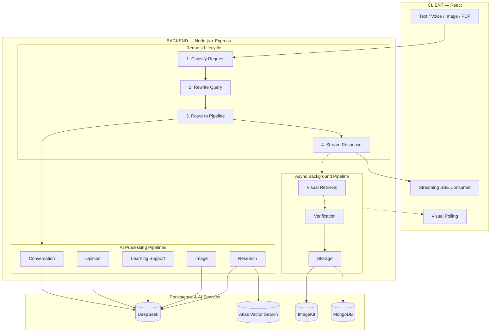
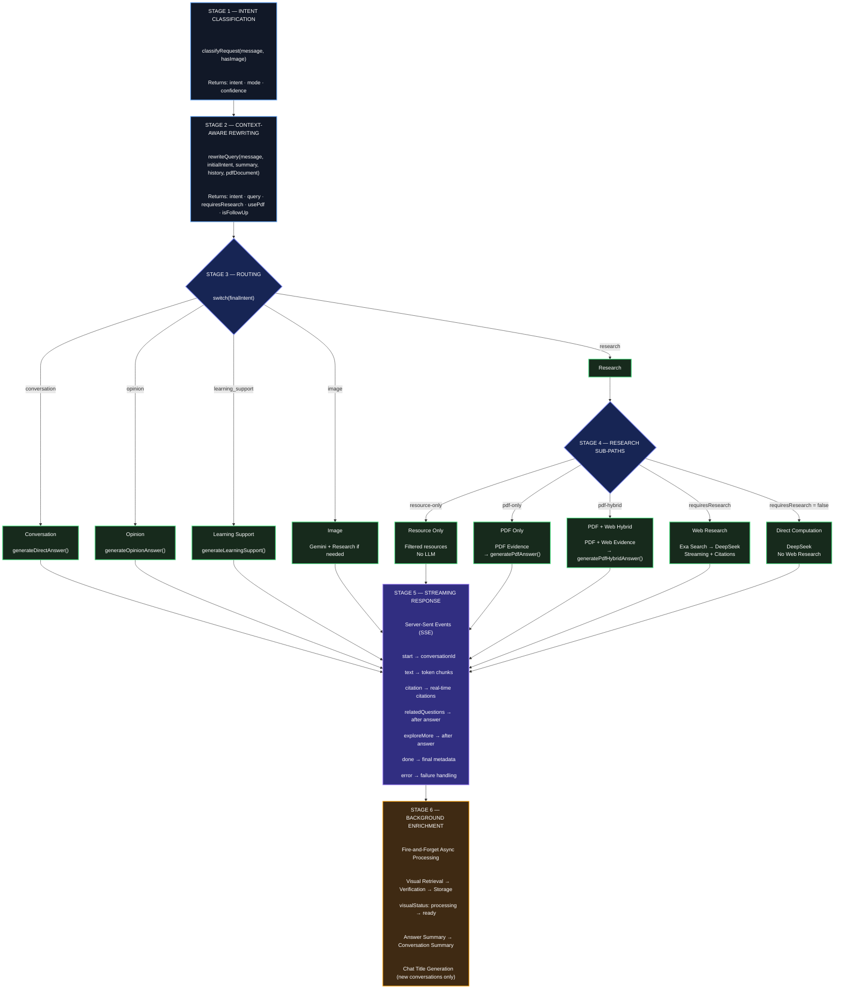
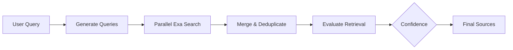
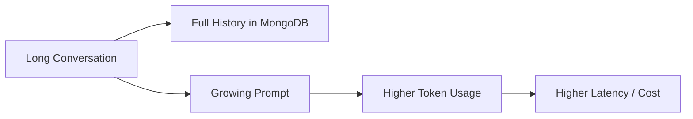
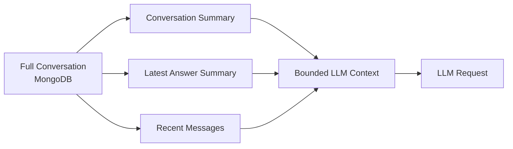
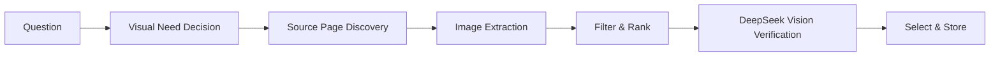
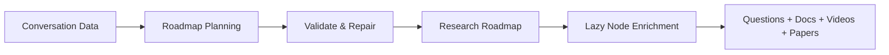
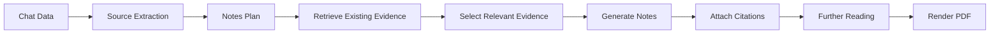

<div align="center">

# **Veritas**

### An Evidence-Backed Research Environment

**Ask. Verify. Explore. Research.**

> *"Veritas does not stop at answering a question.*
> *It helps users verify, explore, research, and build reusable knowledge."*


</div>

---

## Table of Contents

| Section | Description |
|---------|-------------|
| [Overview](#overview) | The problem Veritas solves |
| [What Makes Veritas Different](#what-makes-veritas-different) | Direct comparison with traditional assistants |
| [Features](#features) | Full feature overview |
| [Architecture](#architecture) | System design and pipelines |
| [Tech Stack](#tech-stack) | Frontend, backend, and AI services |
| [Project Structure](#project-structure) | Repository layout |
| [Getting Started](#getting-started) | Setup and configuration |
| [Performance](#performance) | Latency and context characteristics |
| [Engineering Principles](#engineering-principles) | Design philosophy |
| [Reliability](#reliability) | Failure handling |
| [Cost-Aware Architecture](#cost-aware-architecture) | Conditional execution strategy |

---

## Overview

Every modern AI assistant shares the same fundamental flaw: **they hallucinate**. They generate fluent, confident answers that sound correct but are often false — and users have no way to verify them.

Veritas is built on a single principle:

> ### Every factual claim must be traceable to a retrieved source.

This principle drives every design decision. Answers are grounded in retrieved sources, every claim is cited, conversation memory stays bounded, and expensive work happens in the background.

---

## What Makes Veritas Different

| Traditional AI Assistant | Veritas |
|:---|:---|
| `Question → Answer → Stop` | `Question → Research → Evidence → Answer → Verify → Explore → Preserve` |
| Answers from LLM memory | Answers from retrieved sources |
| No citations | Inline clickable citations |
| No learning path | Explore More + Related Questions + Research Roadmap |
| Stale training data | Real-time web search |
| Full history sent to LLM | Bounded context (O(1) memory) |
| Text only | Text + Image + Voice + PDF |
| Separate tools for PDF vs web | PDF + Web hybrid research in one answer |

---

## Features

### Core Research

Veritas performs real-time web research and grounds every answer in retrieved sources.

| Feature | Description |
|:---|:---|
| **RAG Pipeline** | Real-time web search (Exa) with source-grounded answers |
| **Inline Citations** | Every factual claim is linked to its source |
| **Streaming Responses** | Token-by-token streaming across all intents |
| **Multi-Query Retrieval** | 3 parallel searches for broader coverage |
| **Retrieval Confidence Scoring** | HIGH / MEDIUM / LOW based on evidence quality |

### Learning & Exploration

Veritas guides the user from a single answer into deeper understanding.

| Feature | Description |
|:---|:---|
| **Explore More** | Curated documentation, videos, and research papers |
| **Related Questions** | Auto-generated follow-up questions |
| **Learning Support** | Simplify, clarify, or re-explain any answer |
| **Research Roadmap** | Interactive mind map with hover-sourced nodes |

### Research Workflows

Veritas supports end-to-end research workflows, not just Q&A.

| Feature | Description |
|:---|:---|
| **Research-Backed Notes PDF** | Turn conversations into structured, citable documents |
| **PDF Hybrid Research** | Combine private documents with live web research |
| **Verified Diagrams** | Web-sourced visuals verified by DeepSeek Vision |
| **Code Snippets with Citations** | Every code block is source-attributed |

### User Experience

| Feature | Description |
|:---|:---|
| **Multimodal Input** | Text, Voice, Image, PDF |
| **O(1) Conversation Memory** | Bounded context, never grows |
| **Personal Library** | Save and revisit resources |
| **Full Authentication** | JWT + email verification |
| **Responsive UI** | Desktop, tablet, mobile |

---

## Architecture

> Veritas is built as a set of multi-stage, evidence-grounded pipelines.
> Every user-facing feature is powered by a well-defined sequence of retrieval, reasoning, and validation.

<br />

### System Overview

The system is organized into three layers — the React client, the Node.js backend, and the persistence / AI services layer.



<br />

### Request Lifecycle

Every message flows through a six-stage pipeline. Each stage has a single responsibility — classify, rewrite, route, execute, stream, and enrich.



<br />

### Intent Engine

Veritas routes every message through five distinct intents. Each intent has a dedicated pipeline optimized for its purpose, and each supports both streaming and non-streaming modes.

| Intent | Description | Pipeline |
|:---|:---|:---|
| **Conversation** | Greetings, thanks, casual talk | Direct LLM (no search) |
| **Opinion** | Personal perspective, recommendations | Direct LLM (no search) |
| **Learning Support** | Clarify, simplify, re-explain | Previous answer → LLM |
| **Image** | Image-based questions | Gemini → (research if needed) |
| **Research** | Factual, technical, comparative | RAG + PDF hybrid |

<br />

### Retrieval Pipeline

Veritas uses parallel web retrieval, followed by deduplication and retrieval-quality evaluation, before sources are passed to the answer generation pipeline.



<br />

### Memory System

Sending full conversation history to the LLM causes tokens, latency, and cost to grow linearly with conversation length.



Veritas solves this by storing the full conversation in MongoDB but **never sending it all to the LLM**. Instead, each request receives a bounded context built from three fixed-size sources.



The result: response time and cost stay **constant**, whether the conversation has 5 turns or 500.

<br />

### Visual Verification

When the LLM decides a visual would help, Veritas runs a multi-stage pipeline to find the **right** visual — not just any image.



Veritas first determines whether a visual would materially help. If yes, it discovers relevant source pages, extracts candidate images (including high-resolution and lazy-loaded ones), filters out logos and ads, and then uses DeepSeek Vision to verify which candidate directly matches the user's question. The best-scoring visual is then stored for use in the final response.

<br />

### Research Roadmap

The Research Roadmap transforms a conversation into a visual learning path.



Veritas analyzes the conversation and generates a structured roadmap with a single root and hierarchical nodes. The roadmap is validated for valid node types, unique IDs, a single root, and valid parent relationships. When the user explores a node, related resources (research questions, documentation, videos, papers) are lazily fetched — keeping the initial generation lightweight.

<br />

### Research Notes

The Research Notes feature turns a conversation into a structured PDF.



Veritas extracts the conversation summary, questions, answer summaries, and citations, then builds a structured notes plan. Content is retrieved **only from already-cited sources** — no new sources are introduced. Relevant evidence is selected for each section, transformed into structured study material, and rendered as a PDF with citations, code, math, and further-reading resources.

---

## Tech Stack

<table>
<tr>
<td valign="top" width="33%">

**Frontend**

- React 18
- Vite
- React Router
- SCSS
- Context API
- Web Speech API

</td>
<td valign="top" width="33%">

**Backend**

- Node.js 18
- Express
- MongoDB + Mongoose
- Atlas Vector Search
- JWT + bcrypt
- Nodemailer

</td>
<td valign="top" width="34%">

**AI & External APIs**

- DeepSeek
- Google Gemini
- Exa
- YouTube Data API
- ImageKit

</td>
</tr>
</table>

---

## Project Structure

```text
Veritas/
│
├── backend/
│   └── src/
│       ├── config/
│       ├── controllers/
│       ├── middleware/
│       ├── models/
│       ├── routes/
│       ├── services/
│       │   ├── deepseek/
│       │   ├── exa/
│       │   ├── gemini/
│       │   ├── intents/
│       │   ├── notes/
│       │   ├── pdf/
│       │   ├── roadmap/
│       │   ├── routing/
│       │   └── visuals/
│       ├── utils/
│       ├── validators/
│       ├── tests/
│       ├── app.js
│       └── server.js
│
├── frontend/
│   └── src/
│       ├── features/
│       │   ├── auth/
│       │   └── Chats/
│       ├── layouts/
│       ├── App.jsx
│       ├── AppRoutes.jsx
│       └── main.jsx
│
├── .env
├── .gitignore
└── README.md
```

---

## Getting Started

### Prerequisites

Before running Veritas locally, ensure you have:

- Node.js 18+
- MongoDB — local installation or MongoDB Atlas
- API credentials for DeepSeek, Gemini, Exa, YouTube Data API, ImageKit, and Gmail / SMTP

### Installation

```bash
# Clone the repository
git clone https://github.com/Ha1AY3/Veritas.git
cd Veritas

# Install backend dependencies
cd backend
npm install

# Install frontend dependencies
cd ../frontend
npm install
```

### Configuration

Create a `.env` file inside the `backend/` directory:

```env
PORT=5000
NODE_ENV=development

# Database
MONGODB_URI=your_mongodb_uri

# Authentication
JWT_SECRET=your_jwt_secret

# AI / Research
DEEPSEEK_API_KEY=your_key
GEMINI_API_KEY=your_key
EXA_API_KEY=your_key
YOUTUBE_API_KEY=your_key

# Media Storage
IMAGEKIT_PRIVATE_KEY=your_key

# Email
GMAIL_USER=your_email
GMAIL_APP_PASSWORD=your_app_password

# Frontend
CLIENT_URL=http://localhost:5173
```

> **Security:** Never commit your `.env` file or expose API keys in the repository.

### Run

```bash
# Terminal 1 — Backend
cd backend
npm run dev

# Terminal 2 — Frontend
cd frontend
npm run dev
```

The application will be available at:

- **Frontend:** `http://localhost:5173`
- **Backend:** `http://localhost:5000`

---

## Performance

Veritas is designed around parallel execution, bounded LLM context, intelligent routing, and asynchronous background processing.

### Latency Optimizations

| Optimization | Implementation | Benefit |
|:---|:---|:---|
| **Parallel Exa Search** | 3 complementary searches execute concurrently | Reduces retrieval latency |
| **Combined LLM Calls** | Answer + related questions generated together where possible | Reduces redundant inference |
| **Bounded Context** | Summary + latest answer + recent messages | Prevents context growth with conversation length |
| **Background Enrichment** | Visual retrieval and summaries run asynchronously | Does not block the response |
| **Intent Routing** | Skips unnecessary research for simple requests | Avoids unnecessary API calls |
| **Lazy Visual Retrieval** | Visual search runs only when a visual is useful | Reduces unnecessary retrieval |
| **Retry with Backoff** | Handles transient API failures | Improves reliability |

> Latency varies depending on network conditions, external API response times, model load, query complexity, and retrieved content size.

### Context & Storage

| Metric | Design |
|:---|:---|
| **LLM context** | Bounded / approximately ~500 tokens |
| **Conversation storage** | O(n) — complete conversation retained in MongoDB |
| **Recent context** | Fixed number of recent messages |
| **Conversation summaries** | Preserve older context without sending full history |

---

## Engineering Principles

| Principle | How Veritas Applies It |
|:---|:---|
| **Single Responsibility** | Each service focuses on one well-defined responsibility |
| **Separation of Concerns** | Controllers handle HTTP; services handle business logic |
| **Feature-Based Organization** | Complex functionality is grouped into focused service modules |
| **Fail Gracefully** | External API failures use fallbacks and controlled error handling |
| **Defensive Programming** | Inputs, API responses, IDs, and external data are validated |
| **Consistent Interfaces** | Services follow predictable success/error response structures |
| **Database Constraints** | Unique indexes and schema validation prevent invalid duplicates |
| **User Scoping** | User-owned resources are queried with `userId` constraints |
| **Async by Default** | Non-critical enrichment tasks run without blocking the main response |
| **Cost Awareness** | Redundant LLM calls are minimized and retrieval is performed conditionally |
| **Lazy Execution** | Expensive visual and roadmap enrichment occurs only when needed |
| **Evidence Preservation** | Source IDs and citation metadata are carried through the generation pipeline |
| **Version Everything** | Research roadmaps maintain version history for iterative changes |
| **Modular Integrations** | AI and external providers are isolated behind dedicated services |

---

## Reliability

Veritas treats external AI and retrieval services as unreliable dependencies and uses controlled failure handling.

| Practice | Purpose |
|:---|:---|
| **Retry with exponential backoff** | Handles transient API failures |
| **429 / 503 handling** | Manages rate limits and temporary service failures |
| **Fallback paths** | Keeps the system responsive when external services fail |
| **Input validation** | Rejects malformed requests before processing |
| **Response validation** | Ensures external API and LLM outputs are well-formed |
| **Graceful degradation** | Keeps working when optional services are unavailable |
| **User-scoped queries** | Prevents cross-user data access |
| **Database constraints** | Prevents duplicate or invalid records |

---

## Cost-Aware Architecture

Veritas minimizes unnecessary API and LLM usage through conditional execution.

### Optimization Strategies

- Skip web research when the request does not require external information
- Skip visual retrieval when a visual does not materially improve the answer
- Reuse PDF evidence before performing additional web research
- Combine related outputs into a single LLM call where practical
- Run expensive enrichment tasks asynchronously
- Cache roadmap node enrichment
- Limit the number of sources passed to the LLM
- Use summaries instead of sending complete conversation history
- Perform parallel retrieval to reduce duplicated waiting time

### Resource-Aware Research

The research pipeline adapts retrieval based on the user's request.

| Request Type | Retrieval Source |
|:---|:---|
| **Web research** | Exa |
| **PDF research** | Atlas Vector Search |
| **PDF + Web** | Hybrid retrieval |
| **Videos** | YouTube |
| **Documentation / papers** | Resource-specific retrieval |
| **Visual research** | Exa + image extraction + DeepSeek Vision |

The goal is to use the minimum necessary retrieval and inference work while preserving answer quality and evidence traceability.

---

<div align="center">

<br />

### Veritas

#### *Answers you can trust. Learning you can follow. Research you can share.*

<br />

**Built on evidence. Designed for research.**

<br />

</div>
