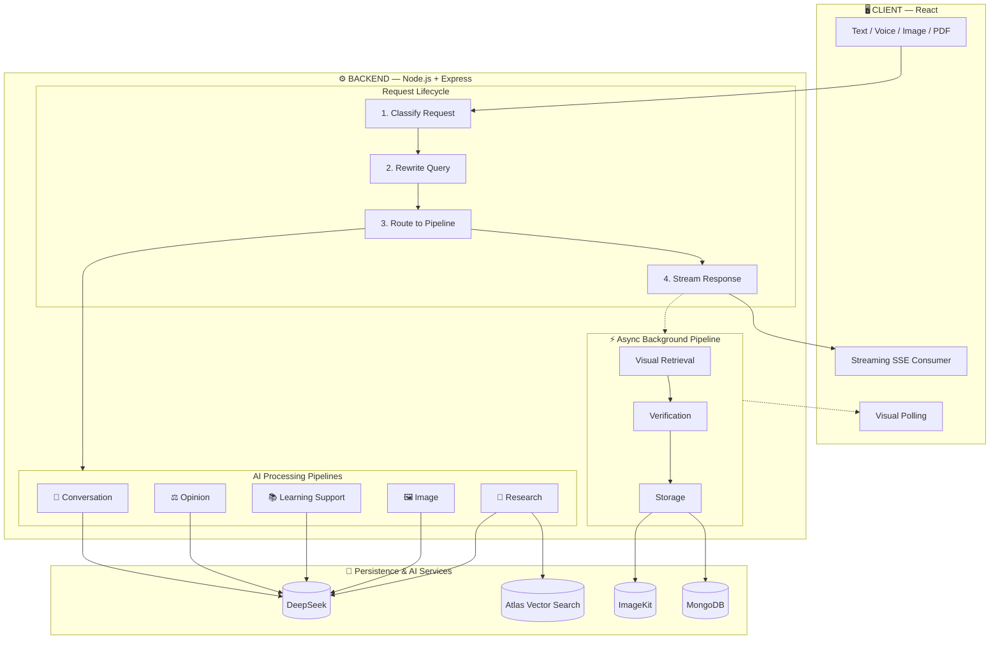

# Veritas

### An Evidence-Backed Research Environment

**Ask. Verify. Explore. Research.**

*"Veritas does not stop at answering a question. It helps users verify, explore, research, and build reusable knowledge."*

 [Documentation](#-architecture-deep-dive) · [Report Bug](https://github.com/Ha1AY3/Veritas/issues) · [Request Feature](https://github.com/Ha1AY3/Veritas/issues)

---

## 📖 Table of Contents

- [The Veritas Philosophy](#-the-veritas-philosophy)
- [What Makes Veritas Different](#-what-makes-veritas-different)
- [Feature Overview](#-feature-overview)
- [Architecture Deep Dive](#-architecture-deep-dive)
  - [System Architecture](#system-architecture)
  - [Request Lifecycle](#request-lifecycle)
  - [Intent Engine](#intent-engine)
  - [Retrieval Pipeline](#retrieval-pipeline)
  - [Memory System](#memory-system-o1)
  - [Visual Verification Pipeline](#visual-verification-pipeline)
  - [PDF Hybrid Research](#pdf-hybrid-research-pipeline)
  - [Research Roadmap](#research-roadmap-generation)
  - [Research Notes PDF](#research-notes-generation)
- [Tech Stack](#-tech-stack)
- [Project Structure](#-project-structure)
- [Getting Started](#-getting-started)
- [Performance Characteristics](#-performance-characteristics)
- [Engineering Principles](#-engineering-principles)
- [Team](#-team)
- [License](#-license)

---

## 🧠 The Veritas Philosophy

Every modern AI assistant shares the same fundamental flaw: **they hallucinate**. They generate fluent, confident answers that sound correct but are often false — and users have no way to verify them.

Veritas is built on a single principle:

> **Every factual claim must be traceable to a retrieved source.**

This principle drives everything:

| Principle | Implementation |
|-----------|----------------|
| **Evidence-first** | Every answer is grounded in retrieved sources |
| **Verifiable** | Inline citations for every claim |
| **Context-bounded** | O(1) memory — never grows with conversation length |
| **Asynchronous** | Visuals, summaries, metadata never block the user |
| **Multimodal** | Text, image, voice, and PDF in one system |
| **Research-oriented** | Not just Q&A — full research workflows |

---

## ⭐ What Makes Veritas Different

| Traditional AI Assistant | Veritas |
|--------------------------|---------|
| `Question → Answer → Stop` | `Question → Research → Evidence → Answer → Verify → Explore → Preserve` |
| Answers from LLM memory | Answers from retrieved sources |
| No citations | Inline clickable citations |
| No learning path | Explore More + Related Questions + Research Roadmap |
| Stale training data | Real-time web search |
| Full history sent to LLM | Bounded context (O(1) memory) |
| Text only | Text + Image + Voice + PDF |
| Separate tools for PDF vs web | PDF + Web hybrid research in one answer |

---

## ✨ Feature Overview

### 🔍 Core Research
- **RAG Pipeline** — Real-time web search (Exa) with source-grounded answers
- **Inline Citations** — Every factual claim is linked to its source
- **Streaming Responses** — Token-by-token streaming across all intents
- **Multi-Query Retrieval** — 3 parallel searches for broader coverage
- **Retrieval Confidence Scoring** — HIGH / MEDIUM / LOW based on evidence quality

### 🎓 Learning & Exploration
- **Explore More** — Curated documentation, videos, and research papers
- **Related Questions** — Auto-generated follow-up questions
- **Learning Support** — Simplify, clarify, or re-explain any answer
- **Research Roadmap** — Interactive mind map with hover-sourced nodes

### 📄 Research Workflows
- **Research-Backed Notes PDF** — Turn conversations into structured, citable documents
- **PDF Hybrid Research** — Combine private documents with live web research
- **Verified Diagrams** — Web-sourced visuals verified by DeepSeek Vision
- **Code Snippets with Citations** — Every code block is source-attributed

### 🎯 User Experience
- **Multimodal Input** — Text, Voice, Image, PDF
- **O(1) Conversation Memory** — Bounded context, never grows
- **Personal Library** — Save and revisit resources
- **Full Authentication** — JWT + email verification
- **Responsive UI** — Desktop, tablet, mobile

---

## 🏗 Architecture Deep Dive

### System Architecture

