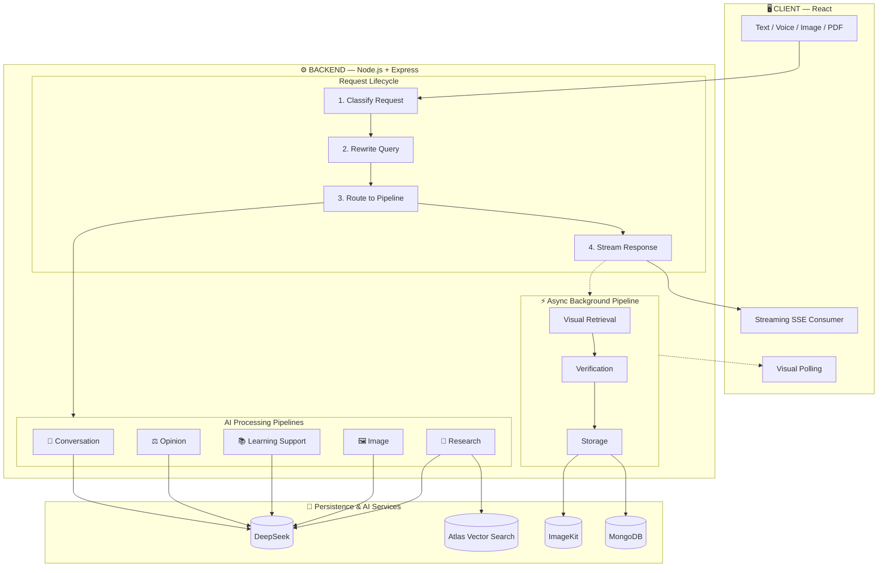
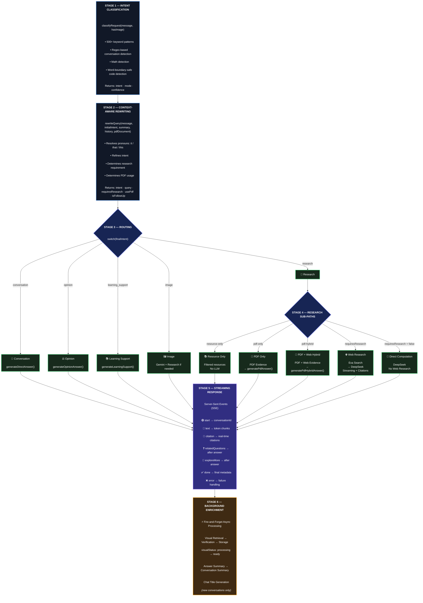
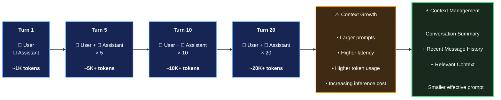
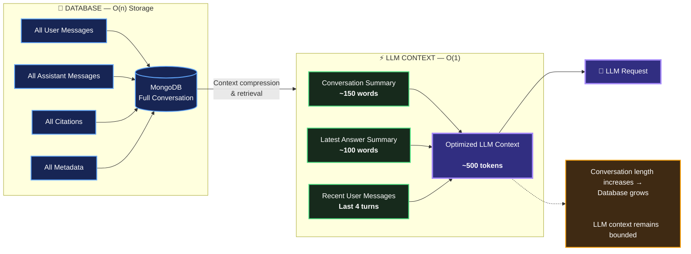
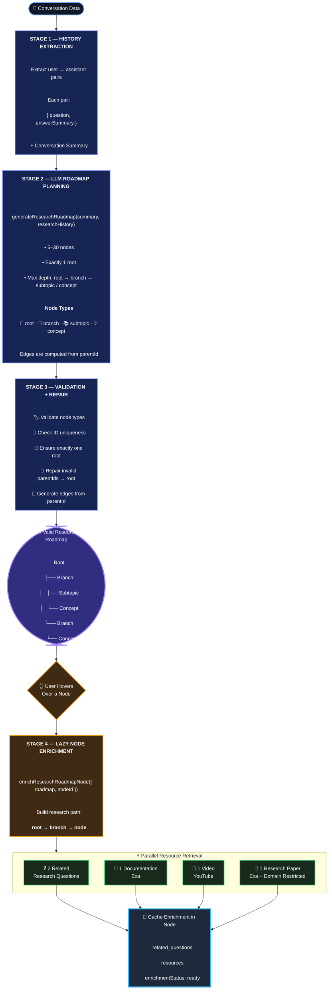

<div align="center">

# Veritas

### An Evidence-Backed Research Environment

**Ask. Verify. Explore. Research.**

[](https://veritas.vercel.app)
[](https://veritas-backend.onrender.com)
[](LICENSE)
[](https://nodejs.org)
[](https://react.dev)

*"Veritas does not stop at answering a question. It helps users verify, explore, research, and build reusable knowledge."*

 [Documentation](#-architecture-deep-dive) · [Report Bug](https://github.com/Ha1AY3/Veritas/issues) · [Request Feature](https://github.com/Ha1AY3/Veritas/issues)

</div>

---

## 📖 Table of Contents

- [The Veritas Philosophy](#-the-veritas-philosophy)
- [What Makes Veritas Different](#-what-makes-veritas-different)
- [Feature Overview](#-feature-overview)
- [Architecture Deep Dive](#-architecture-deep-dive)
  - [System Architecture](#system-architecture)
  - [Request Lifecycle](#request-lifecycle)
  - [Intent Engine](#intent-engine)
  - [Retrieval Pipeline](#retrieval-pipeline)
  - [Memory System](#memory-system-o1)
  - [Visual Verification Pipeline](#visual-verification-pipeline)
  - [PDF Hybrid Research](#pdf-hybrid-research-pipeline)
  - [Research Roadmap](#research-roadmap-generation)
  - [Research Notes PDF](#research-notes-generation)
- [Tech Stack](#-tech-stack)
- [Project Structure](#-project-structure)
- [Getting Started](#-getting-started)
- [Performance Characteristics](#-performance-characteristics)
- [Engineering Principles](#-engineering-principles)
- [Team](#-team)
- [License](#-license)

---

## 🧠 The Veritas Philosophy

Every modern AI assistant shares the same fundamental flaw: **they hallucinate**. They generate fluent, confident answers that sound correct but are often false — and users have no way to verify them.

Veritas is built on a single principle:

> **Every factual claim must be traceable to a retrieved source.**

This principle drives everything:

| Principle | Implementation |
|-----------|----------------|
| **Evidence-first** | Every answer is grounded in retrieved sources |
| **Verifiable** | Inline citations for every claim |
| **Context-bounded** | O(1) memory — never grows with conversation length |
| **Asynchronous** | Visuals, summaries, metadata never block the user |
| **Multimodal** | Text, image, voice, and PDF in one system |
| **Research-oriented** | Not just Q&A — full research workflows |

---

## ⭐ What Makes Veritas Different

| Traditional AI Assistant | Veritas |
|--------------------------|---------|
| `Question → Answer → Stop` | `Question → Research → Evidence → Answer → Verify → Explore → Preserve` |
| Answers from LLM memory | Answers from retrieved sources |
| No citations | Inline clickable citations |
| No learning path | Explore More + Related Questions + Research Roadmap |
| Stale training data | Real-time web search |
| Full history sent to LLM | Bounded context (O(1) memory) |
| Text only | Text + Image + Voice + PDF |
| Separate tools for PDF vs web | PDF + Web hybrid research in one answer |

---

## ✨ Feature Overview

### 🔍 Core Research
- **RAG Pipeline** — Real-time web search (Exa) with source-grounded answers
- **Inline Citations** — Every factual claim is linked to its source
- **Streaming Responses** — Token-by-token streaming across all intents
- **Multi-Query Retrieval** — 3 parallel searches for broader coverage
- **Retrieval Confidence Scoring** — HIGH / MEDIUM / LOW based on evidence quality

### 🎓 Learning & Exploration
- **Explore More** — Curated documentation, videos, and research papers
- **Related Questions** — Auto-generated follow-up questions
- **Learning Support** — Simplify, clarify, or re-explain any answer
- **Research Roadmap** — Interactive mind map with hover-sourced nodes

### 📄 Research Workflows
- **Research-Backed Notes PDF** — Turn conversations into structured, citable documents
- **PDF Hybrid Research** — Combine private documents with live web research
- **Verified Diagrams** — Web-sourced visuals verified by DeepSeek Vision
- **Code Snippets with Citations** — Every code block is source-attributed

### 🎯 User Experience
- **Multimodal Input** — Text, Voice, Image, PDF
- **O(1) Conversation Memory** — Bounded context, never grows
- **Personal Library** — Save and revisit resources
- **Full Authentication** — JWT + email verification
- **Responsive UI** — Desktop, tablet, mobile

---

## 🏗 Architecture Deep Dive

### System Architecture




### Request Lifecycle

Every message flows through a **6-stage pipeline**:




### Intent Engine

Veritas routes every message through **five distinct intents**:

| Intent | Description | Pipeline |
|--------|-------------|----------|
| **Conversation** | Greetings, thanks, casual talk | Direct LLM (no search) |
| **Opinion** | Personal perspective, recommendations | Direct LLM (no search) |
| **Learning Support** | Clarify, simplify, re-explain | Previous answer → LLM |
| **Image** | Image-based questions | Gemini → (research if needed) |
| **Research** | Factual, technical, comparative | RAG + PDF hybrid |

Each intent has its own **streaming and non-streaming modes**.

### Retrieval Pipeline

```mermaid
flowchart TD

    %% =========================
    %% INPUT
    %% =========================

    QUERY(["👤 User Query"])


    %% =========================
    %% QUERY GENERATION
    %% =========================

    QG["<b>1. QUERY GENERATION</b><br/><br/>
    generateQueries(query, summary, history, resourceFilter)<br/><br/>
    • 3 complementary retrieval queries<br/>
    • Generated in parallel<br/>
    • 1 video query + topic classification<br/>
    • Resource-aware query generation<br/>
    • Docs / Videos / Papers receive tailored queries"]


    %% =========================
    %% PARALLEL EXA SEARCH
    %% =========================

    SEARCH{"<b>2. PARALLEL EXA SEARCH</b><br/><br/>
    Promise.all([...])"}

    Q1["🔎 Search Query 1<br/><br/>searchAndFormatExa(q1)"]
    Q2["🔎 Search Query 2<br/><br/>searchAndFormatExa(q2)"]
    Q3["🔎 Search Query 3<br/><br/>searchAndFormatExa(q3)"]

    RETRY["🔄 Retry with<br/>Exponential Backoff<br/><br/>429 / 503 Handling"]


    %% =========================
    %% MERGE
    %% =========================

    MERGE["<b>3. MERGE + DEDUPLICATE</b><br/><br/>
    mergeAndDeduplicate(results)<br/><br/>
    • URL normalization<br/>
    • Duplicate removal<br/>
    • Maximum 5 sources passed to LLM"]


    %% =========================
    %% EVALUATION
    %% =========================

    EVAL["<b>4. RETRIEVAL EVALUATION</b><br/><br/>
    evaluateRetrieval(results, query)<br/><br/>
    📊 Result Count — 0 to 3<br/>
    🖍️ Highlight Coverage — 0 to 3<br/>
    🌐 Hostname Diversity — 0 to 1<br/>
    🔤 Lexical Relevance — 0 to 2<br/><br/>
    Returns:<br/>
    confidence · score · metrics"]


    %% =========================
    %% CONFIDENCE
    %% =========================

    CONFIDENCE{"<b>RETRIEVAL CONFIDENCE</b>"}

    HIGH["🟢 HIGH<br/><br/>Strong retrieval evidence"]
    MEDIUM["🟡 MEDIUM<br/><br/>Moderate evidence"]
    LOW["🔴 LOW<br/><br/>Weak or insufficient evidence"]


    %% =========================
    %% FINAL OUTPUT
    %% =========================

    FINAL(["📚 Final Sources + Confidence"])


    %% =========================
    %% FLOW
    %% =========================

    QUERY --> QG
    QG --> SEARCH

    SEARCH --> Q1
    SEARCH --> Q2
    SEARCH --> Q3

    Q1 --> RETRY
    Q2 --> RETRY
    Q3 --> RETRY

    RETRY --> MERGE

    MERGE --> EVAL
    EVAL --> CONFIDENCE

    CONFIDENCE -->|"score"| HIGH
    CONFIDENCE -->|"score"| MEDIUM
    CONFIDENCE -->|"score"| LOW

    HIGH --> FINAL
    MEDIUM --> FINAL
    LOW --> FINAL


    %% =========================
    %% STYLING
    %% =========================

    classDef input fill:#111827,stroke:#60a5fa,color:#ffffff,stroke-width:2px;
    classDef stage fill:#172554,stroke:#818cf8,color:#ffffff,stroke-width:2px;
    classDef search fill:#172a1c,stroke:#4ade80,color:#ffffff,stroke-width:2px;
    classDef retry fill:#3f2a13,stroke:#f59e0b,color:#ffffff,stroke-width:2px;
    classDef eval fill:#312e81,stroke:#a78bfa,color:#ffffff,stroke-width:2px;
    classDef confidence fill:#111827,stroke:#94a3b8,color:#ffffff,stroke-width:2px;
    classDef output fill:#1e293b,stroke:#38bdf8,color:#ffffff,stroke-width:3px;

    class QUERY,FINAL input;
    class QG,SEARCH,MERGE stage;
    class Q1,Q2,Q3 search;
    class RETRY retry;
    class EVAL eval;
    class CONFIDENCE,HIGH,MEDIUM,LOW confidence;
```




### Memory System (O(1))

**The problem with naive conversation memory:**

## 🧠 Conversation Context Management




**Veritas's solution — bounded context:**




**Result:** Response time and cost stay **constant** whether the conversation has 5 turns or 500.

### Visual Verification Pipeline

Finding the **right** visual — not just any image:

```mermaid
flowchart TD

    INPUT(["👤 User Question<br/>+ Visual Query"])

    %% STAGE 1
    S1["<b>STAGE 1 — VISUAL NEED DECISION</b><br/><br/>
    decideVisualNeed(question, summary, history)<br/><br/>
    • Determines whether a visual materially helps<br/>
    • Scope: single_concept / end_to_end<br/>
    • Extracts 3–6 required concepts<br/>
    • Generates precise visual search query"]

    %% STAGE 2
    S2["<b>STAGE 2 — SOURCE PAGE DISCOVERY</b><br/><br/>
    Exa Search<br/><br/>
    → 10 source pages"]

    %% STAGE 3
    S3["<b>STAGE 3 — IMAGE EXTRACTION</b><br/><br/>
    extractPageImages(sourceUrl)<br/><br/>
    • Cheerio HTML parsing<br/>
    • srcset → highest resolution<br/>
    • Lazy-load attributes<br/>
    • Figure caption extraction<br/><br/>
    <b>Max 20 images/page</b><br/>
    10 pages × 20 = <b>200 candidates</b>"]

    %% STAGE 4
    S4["<b>STAGE 4 — FILTER + RANK</b><br/><br/>
    collectVisualCandidates(pages, query)<br/><br/>
    🚫 Blocklist: logos · icons · avatars<br/>
    🚫 Banners · ads · spinners<br/>
    🔤 Keyword scoring<br/>
    🔎 Query-term matching<br/>
    📐 Size preference ≥ 800×600<br/><br/>
    → <b>Top 10 candidates</b>"]

    %% STAGE 5
    S5["<b>STAGE 5 — DEEPSEEK VISION VERIFICATION</b><br/><br/>
    verifyVisualsWithDeepSeek(...)<br/><br/>
    • Convert candidates to base64<br/>
    • Send candidates + question to Vision model<br/>
    • Score direct relevance: <b>0–10</b><br/><br/>
    Returns:<br/>
    candidate · relevant · score · reason"]

    %% STAGE 6
    S6{"<b>STAGE 6 — SELECT + PERSIST</b><br/><br/>
    relevant && score ≥ 7"}

    REJECT["❌ Discard<br/>Irrelevant visuals"]

    SELECT["✅ Select<br/>Highest-scoring candidate"]

    STORE["☁️ ImageKit<br/><br/>
    Upload visual<br/>
    → Persistent URL"]

    SAVE["💾 Save URL<br/>to Message"]

    %% FLOW
    INPUT --> S1 --> S2 --> S3 --> S4 --> S5 --> S6

    S6 -->|"Fails threshold"| REJECT
    S6 -->|"Passes threshold"| SELECT

    SELECT --> STORE --> SAVE


    %% STYLING
    classDef input fill:#111827,stroke:#60a5fa,color:#ffffff,stroke-width:2px;
    classDef stage fill:#172554,stroke:#818cf8,color:#ffffff,stroke-width:2px;
    classDef vision fill:#312e81,stroke:#a78bfa,color:#ffffff,stroke-width:2px;
    classDef decision fill:#3f2a13,stroke:#f59e0b,color:#ffffff,stroke-width:2px;
    classDef success fill:#172a1c,stroke:#4ade80,color:#ffffff,stroke-width:2px;
    classDef reject fill:#3f1d1d,stroke:#f87171,color:#ffffff,stroke-width:2px;

    class INPUT input;
    class S1,S2,S3,S4 stage;
    class S5 vision;
    class S6 decision;
    class SELECT,STORE,SAVE success;
    class REJECT reject;
```




### Research Roadmap Generation

Transforming a conversation into a **visual learning path**:




### Research Notes Generation

Turning a conversation into a **structured PDF**:

```mermaid
flowchart TD

    %% =========================
    %% INPUT
    %% =========================

    INPUT(["💬 Chat ID"])


    %% =========================
    %% STAGE 1
    %% =========================

    S1["<b>STAGE 1 — SOURCE DATA EXTRACTION</b><br/><br/>
    getNotesSourceData(chatId, userId)<br/><br/>
    • Conversation summary<br/>
    • All user questions<br/>
    • All answer summaries<br/>
    • Unique citations<br/>
    • explore_more resources"]


    %% =========================
    %% STAGE 2
    %% =========================

    S2["<b>STAGE 2 — NOTES PLAN</b><br/><br/>
    generateNotesPlan(sourceData)<br/><br/>
    🧠 LLM creates section structure<br/>
    🔗 Every section references source_N IDs<br/><br/>
    <b>No content generated yet</b><br/>
    → Structure only"]


    %% =========================
    %% STAGE 3
    %% =========================

    S3["<b>STAGE 3 — EVIDENCE RETRIEVAL</b><br/><br/>
    Exa Contents API<br/><br/>
    Fetch exact content from<br/>
    previously saved citation URLs<br/><br/>
    🔒 Restricted to already-cited sources<br/>
    🚫 No new sources introduced"]


    %% =========================
    %% STAGE 4
    %% =========================

    S4["<b>STAGE 4 — EVIDENCE SELECTION</b><br/><br/>
    For each notes section:<br/><br/>
    1️⃣ Chunk source content<br/>
    &nbsp;&nbsp;&nbsp;2500 chars · paragraph-aware<br/>
    2️⃣ Score chunks by keyword overlap<br/>
    3️⃣ Select highest-scoring chunks<br/>
    4️⃣ Cap evidence at 5000 chars/section"]


    %% =========================
    %% STAGE 5
    %% =========================

    S5["<b>STAGE 5 — NOTES GENERATION</b><br/><br/>
    generateNotesFromEvidence(plan, evidence, exaResponse)<br/><br/>
    📖 Study-material style<br/>
    • 4–6 content items per section<br/>
    • Every fact carries sourceIds<br/>
    • ASCII-safe mathematical notation<br/><br/>
    → Structured research notes"]


    %% =========================
    %% STAGE 6
    %% =========================

    S6["<b>STAGE 6 — CITATION ATTACHMENT</b><br/><br/>
    attachCitationMetadata(notes, evidenceData)<br/><br/>
    Map sourceIds →<br/>
    🔗 URL<br/>
    📰 Title<br/>
    🌐 Hostname"]


    %% =========================
    %% STAGE 7
    %% =========================

    S7["<b>STAGE 7 — FURTHER READING</b><br/><br/>
    generateNotesFurtherReading(plan)<br/><br/>
    → Explore More resources<br/>
    for the roadmap / notes topic"]


    %% =========================
    %% STAGE 8
    %% =========================

    S8["<b>STAGE 8 — PDF RENDERING</b><br/><br/>
    generateNotesPdf(notes, furtherReading)<br/><br/>
    `Inline code`<br/>
    📐 Styled math blocks<br/>
    💻 Syntax-highlighted code<br/>
    🔗 Grouped citations<br/>
    🔗 Clickable source links<br/>
    📇 Resource cards<br/>
    📄 Page footer + page numbers"]


    %% =========================
    %% OUTPUT
    %% =========================

    OUTPUT(["📄 Veritas Research Notes PDF<br/><br/>
    Structured · Evidence-backed · Citable"])


    %% =========================
    %% FLOW
    %% =========================

    INPUT --> S1
    S1 --> S2
    S2 --> S3
    S3 --> S4
    S4 --> S5
    S5 --> S6
    S6 --> S7
    S7 --> S8
    S8 --> OUTPUT


    %% =========================
    %% STYLING
    %% =========================

    classDef input fill:#111827,stroke:#60a5fa,color:#ffffff,stroke-width:2px;
    classDef planning fill:#172554,stroke:#818cf8,color:#ffffff,stroke-width:2px;
    classDef evidence fill:#172a1c,stroke:#4ade80,color:#ffffff,stroke-width:2px;
    classDef generation fill:#312e81,stroke:#a78bfa,color:#ffffff,stroke-width:2px;
    classDef rendering fill:#3f2a13,stroke:#f59e0b,color:#ffffff,stroke-width:2px;
    classDef output fill:#1e293b,stroke:#38bdf8,color:#ffffff,stroke-width:3px;

    class INPUT input;
    class S1,S2 planning;
    class S3,S4 evidence;
    class S5,S6,S7 generation;
    class S8 rendering;
    class OUTPUT output;
```




---

## 🛠 Tech Stack

### Frontend
| Tech | Purpose |
|------|---------|
| **React 18** | UI framework |
| **Vite** | Build tool |
| **React Router** | Navigation |
| **Tailwind CSS + SCSS** | Styling |
| **Context API** | State management |
| **Web Speech API** | Voice input/output |

### Backend
| Tech | Purpose |
|------|---------|
| **Node.js 18** | Runtime |
| **Express** | Web framework |
| **MongoDB + Mongoose** | Primary database |
| **Atlas Vector Search** | Semantic PDF retrieval |
| **JWT + bcrypt** | Authentication |
| **Nodemailer** | Email verification |

### AI & External APIs
| Service | Purpose |
|---------|---------|
| **DeepSeek** | Reasoning, streaming, vision verification |
| **Google Gemini** | Image analysis, embeddings |
| **Exa** | Real-time web search + contents |
| **YouTube Data API** | Educational videos |
| **ImageKit** | Image + PDF persistent storage |

---

## 📁 Project Structure

## 🗂️ Project Structure

```mermaid
flowchart TB

    ROOT["<b>VERITAS</b><br/>Trustworthy AI Research Assistant"]

    %% =========================
    %% FRONTEND
    %% =========================

    subgraph FRONTEND["⚛️ FRONTEND — React"]
        direction TB

        FAPP["App.jsx<br/>AppRoutes.jsx<br/>main.jsx"]

        subgraph FEATURES["Feature Modules"]
            direction LR

            AUTH["🔐 AUTH<br/><br/>
            Components<br/>
            Hooks<br/>
            Pages<br/>
            Services<br/>
            Context"]

            CHATS["💬 CHATS<br/><br/>
            Components<br/>
            Context<br/>
            Hooks<br/>
            Pages<br/>
            Services"]

        end

        LAYOUT["Layouts"]

        FAPP --> FEATURES
        FAPP --> LAYOUT
    end


    %% =========================
    %% BACKEND
    %% =========================

    subgraph BACKEND["🟢 BACKEND — Node.js + Express"]
        direction TB

        APP["app.js<br/>server.js"]

        subgraph API["API Layer"]
            direction LR

            CONTROLLERS["Controllers<br/><br/>
            Auth<br/>
            Chat<br/>
            Library<br/>
            Notes<br/>
            PDF Upload<br/>
            Roadmap"]

            ROUTES["Routes<br/><br/>
            Auth<br/>
            Chat<br/>
            Library"]

            MIDDLEWARE["Middleware<br/><br/>
            Authentication"]

        end

        subgraph CORE["⚙️ Business Logic"]
            direction LR

            ROUTING["Routing<br/><br/>
            Intent Classification<br/>
            Query Rewriting<br/>
            Request Routing"]

            INTENTS["Intent Pipelines<br/><br/>
            Direct Answer<br/>
            Learning Support<br/>
            Opinion"]

            RESEARCH["Research Services<br/><br/>
            Exa<br/>
            Retrieval<br/>
            Resources<br/>
            YouTube"]

            PDF["PDF Services<br/><br/>
            Extraction<br/>
            Embeddings<br/>
            Retrieval<br/>
            Hybrid Research<br/>
            Citations"]

            VISUALS["Visual Services<br/><br/>
            Image Extraction<br/>
            Candidate Ranking<br/>
            Vision Verification<br/>
            Storage"]

            ROADMAP["Roadmap Services<br/><br/>
            Generation<br/>
            Validation<br/>
            Enrichment"]

            NOTES["Notes Services<br/><br/>
            Notes Generation<br/>
            PDF Generation"]

        end

        subgraph INTEGRATIONS["🤖 AI / External Integrations"]
            direction LR

            DEEPSEEK["DeepSeek<br/><br/>
            Reasoning<br/>
            Streaming<br/>
            Summaries<br/>
            Vision Verification"]

            GEMINI["Gemini<br/><br/>
            Vision<br/>
            Embeddings<br/>
            Image Processing"]

            EXA["Exa<br/><br/>
            Web Search<br/>
            Content Retrieval"]

            YOUTUBE["YouTube<br/><br/>
            Video Resources"]

            IMAGEKIT["ImageKit<br/><br/>
            Image / PDF Storage"]

        end

        UTILS["🧰 Shared Utilities<br/><br/>
        Citations · Retrieval Evaluation<br/>
        Result Merging · Query Generation<br/>
        Query Rewriting"]

        MODELS["🗄️ Models<br/><br/>
        Users · Chats · Messages<br/>
        PDFs · PDF Chunks<br/>
        Library · Roadmaps"]

        DB["🍃 MongoDB"]

        APP --> API
        API --> CORE

        ROUTING --> INTENTS
        ROUTING --> RESEARCH
        ROUTING --> PDF
        ROUTING --> VISUALS

        CORE --> INTEGRATIONS
        CORE --> UTILS
        CORE --> MODELS

        MODELS --> DB
    end


    %% =========================
    %% CONNECTIONS
    %% =========================

    ROOT --> FRONTEND
    ROOT --> BACKEND

    FRONTEND -->|"HTTP / SSE"| API

    %% =========================
    %% STYLING
    %% =========================

    classDef root fill:#111827,stroke:#60a5fa,color:#ffffff,stroke-width:3px;
    classDef frontend fill:#172554,stroke:#60a5fa,color:#ffffff,stroke-width:2px;
    classDef backend fill:#172a1c,stroke:#4ade80,color:#ffffff,stroke-width:2px;
    classDef api fill:#312e81,stroke:#818cf8,color:#ffffff,stroke-width:2px;
    classDef service fill:#1e293b,stroke:#94a3b8,color:#ffffff,stroke-width:2px;
    classDef integration fill:#3f2a13,stroke:#f59e0b,color:#ffffff,stroke-width:2px;
    classDef database fill:#164e63,stroke:#22d3ee,color:#ffffff,stroke-width:3px;

    class ROOT root;
    class FAPP,AUTH,CHATS,LAYOUT frontend;
    class APP,UTILS,MODELS backend;
    class CONTROLLERS,ROUTES,MIDDLEWARE api;
    class ROUTING,INTENTS,RESEARCH,PDF,VISUALS,ROADMAP,NOTES service;
    class DEEPSEEK,GEMINI,EXA,YOUTUBE,IMAGEKIT integration;
    class DB database;
```




---

## 🚀 Getting Started

### Prerequisites

Before running Veritas locally, make sure you have:

- **Node.js 18+**
- **MongoDB** — local installation or MongoDB Atlas
- API credentials for:
  - DeepSeek
  - Gemini
  - Exa
  - YouTube Data API
  - ImageKit
  - Gmail / SMTP

### Installation

#### 1. Clone the Repository

```bash
git clone https://github.com/Ha1AY3/Veritas.git
cd Veritas
```

#### 2. Install Backend Dependencies

```bash
cd backend
npm install
```

#### 3. Install Frontend Dependencies

```bash
cd ../frontend
npm install
```

### Configuration

Create a `.env` file inside the `backend/` directory:

```env
PORT=5000
NODE_ENV=development

# Database
MONGODB_URI=your_mongodb_uri

# Authentication
JWT_SECRET=your_jwt_secret

# AI / Research
DEEPSEEK_API_KEY=your_key
GEMINI_API_KEY=your_key
EXA_API_KEY=your_key
YOUTUBE_API_KEY=your_key

# Media Storage
IMAGEKIT_PRIVATE_KEY=your_key

# Email
GMAIL_USER=your_email
GMAIL_APP_PASSWORD=your_app_password

# Frontend
CLIENT_URL=http://localhost:5173
```

> 🔐 **Security:** Never commit your `.env` file or expose API keys in the repository.

### Run

Start the backend:

```bash
cd backend
npm run dev
```

Start the frontend in a second terminal:

```bash
cd frontend
npm run dev
```

The application will be available at:

- **Frontend:** `http://localhost:5173`
- **Backend:** `http://localhost:5000`

---

## ⚡ Performance & Optimization

Veritas is designed around **parallel execution, bounded LLM context, intelligent routing, and asynchronous background processing**.

### Latency Optimizations

| Optimization | Implementation | Benefit |
| :--- | :--- | :--- |
| **Parallel Exa Search** | 3 complementary searches execute concurrently | Reduces retrieval latency |
| **Combined LLM Calls** | Answer + related questions generated together where possible | Reduces redundant inference |
| **Bounded Context** | Summary + latest answer + recent messages | Prevents context growth with conversation length |
| **Background Enrichment** | Visual retrieval and summaries run asynchronously | Does not block the response |
| **Intent Routing** | Skips unnecessary research for simple requests | Avoids unnecessary API calls |
| **Lazy Visual Retrieval** | Visual search runs only when a visual is useful | Reduces unnecessary retrieval |
| **Retry with Backoff** | Handles transient API failures | Improves reliability |

### Response Latency

| Scenario | Typical Latency |
| :--- | :---: |
| Simple query / greeting | ~1–2s |
| Standard research query | ~2.5–4s |
| Image analysis | ~2.5–4s |
| PDF hybrid research | ~4–6s |

> **Note:** Latency varies depending on network conditions, external API response times, model load, query complexity, and retrieved content size.

### Context & Storage Characteristics

| Metric | Design |
| :--- | :--- |
| **LLM context** | Bounded / approximately ~500 tokens |
| **Conversation storage** | O(n) — complete conversation retained in MongoDB |
| **Recent context** | Fixed number of recent messages |
| **Conversation summaries** | Preserve older context without sending full history |
| **Caching** | Redis-ready for frequently accessed data |

---

## 🧩 Engineering Principles

| Principle | How Veritas Applies It |
| :--- | :--- |
| **Single Responsibility** | Each service focuses on one well-defined responsibility |
| **Separation of Concerns** | Controllers handle HTTP; services handle business logic |
| **Feature-Based Organization** | Complex functionality is grouped into focused service modules |
| **Fail Gracefully** | External API failures use fallbacks and controlled error handling |
| **Defensive Programming** | Inputs, API responses, IDs, and external data are validated |
| **Consistent Interfaces** | Services follow predictable success/error response structures |
| **Database Constraints** | Unique indexes and schema validation prevent invalid duplicates |
| **User Scoping** | User-owned resources are queried with `userId` constraints |
| **Async by Default** | Non-critical enrichment tasks run without blocking the main response |
| **Cost Awareness** | Redundant LLM calls are minimized and retrieval is performed conditionally |
| **Lazy Execution** | Expensive visual and roadmap enrichment occurs only when needed |
| **Evidence Preservation** | Source IDs and citation metadata are carried through the generation pipeline |
| **Version Everything** | Research roadmaps maintain version history for iterative changes |
| **Modular Integrations** | AI and external providers are isolated behind dedicated services |

---

## 🛡️ Reliability & Defensive Design

Veritas treats external AI and retrieval services as unreliable dependencies and uses controlled failure handling.

- **Retry with exponential backoff** for transient API failures
- **429 / 503 handling** for rate limits and temporary service failures
- **Fallback paths** when external services fail
- **Input validation** before processing requests
- **Response validation** for external API and LLM outputs
- **Graceful degradation** when optional services are unavailable
- **User-scoped database queries** to prevent cross-user data access
- **Database constraints** to prevent duplicate or invalid records

---

## 💰 Cost-Aware Architecture

Veritas minimizes unnecessary API and LLM usage through conditional execution.

### Optimization Strategies

- Skip web research when the request does not require external information
- Skip visual retrieval when a visual does not materially improve the answer
- Reuse PDF evidence before performing additional web research
- Combine related outputs into a single LLM call where practical
- Run expensive enrichment tasks asynchronously
- Cache roadmap node enrichment
- Limit the number of sources passed to the LLM
- Use summaries instead of sending complete conversation history
- Perform parallel retrieval to reduce duplicated waiting time

### Resource-Aware Research

The research pipeline adapts retrieval based on the user's request:

- **Web research** → Exa
- **PDF research** → Atlas Vector Search
- **PDF + Web** → Hybrid retrieval
- **Videos** → YouTube
- **Documentation / papers** → Resource-specific retrieval
- **Visual research** → Exa + image extraction + DeepSeek Vision

> The goal is to use the **minimum necessary retrieval and inference work** while preserving answer quality and evidence traceability.

